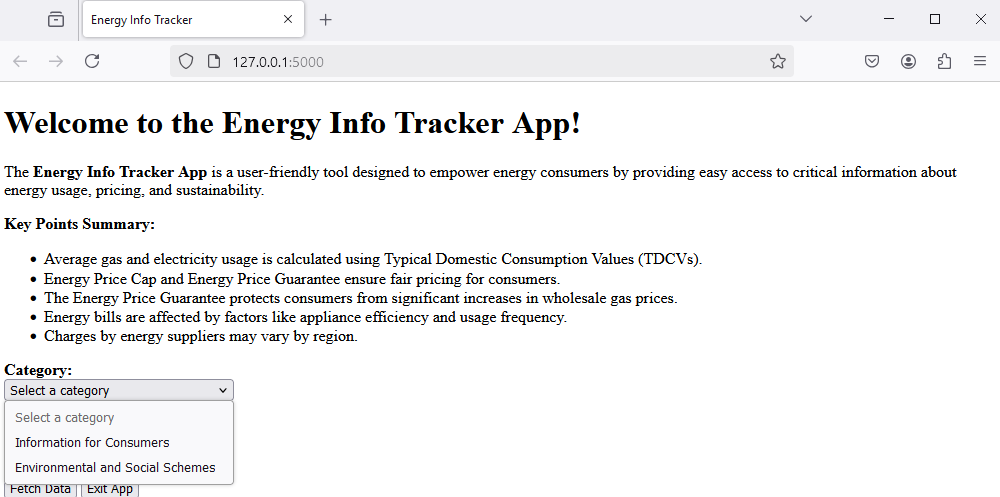
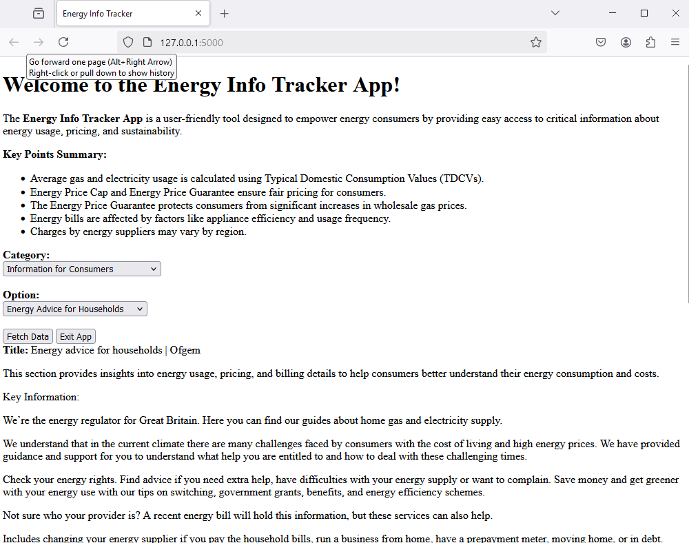
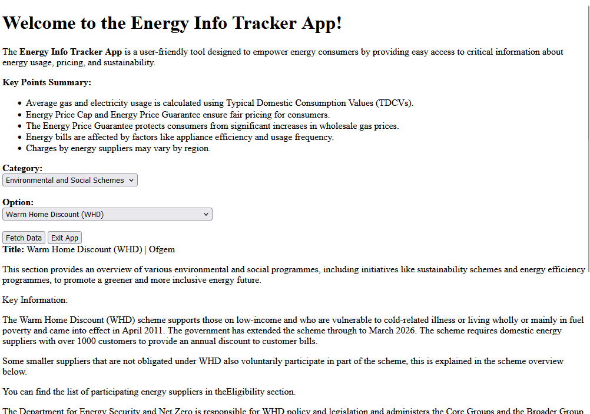

# Energy Info Tracker App

The **Energy Info Tracker App** is  a user-friendly tool designed to empower energy consumers by providing easy access to critical information about energy usage, pricing, and sustainability. It serves as a centralized platform to educate and inform users about various aspects of energy consumption and related environmental and social initiatives.




## Key Features

### Consumer Information:
- Detailed guidance on managing energy consumption and reducing bills.
- Insights into understanding electricity and gas bills, including terminologies and charges.
- Information on the energy price cap, standing charges, and regional unit rates.
- Tips on switching energy suppliers to secure better deals and savings.

### Environmental Awareness:
- Highlights on renewable energy adoption and its impact on the environment.
- Guidance on how to reduce carbon footprints through energy-efficient practices.
- Updates on government and industry initiatives aimed at sustainable energy use.

### Social and Financial Support Schemes:
- Information on grants, subsidies, and schemes for low-income households.
- Details of social tariffs and financial assistance for vulnerable consumers.
- Access to resources on energy efficiency improvements, such as home insulation and smart meter installation.

## Benefits

### Accessibility:
- Simple navigation with clear categorization of topics.

### Real-Time Data:
- Fetches up-to-date information directly from Ofgem(Office of Gas and Electricity Markets)

### Education & Awareness:
- Empowers users with actionable knowledge to make informed decisions about their energy use.

### Support for Sustainability:
- Encourages eco-friendly practices and participation in environmental initiatives.

The **Energy Info Tracker App** bridges the gap between consumers and the often-complex world of energy, helping users save money while contributing to a more sustainable and socially conscious energy future.

---

## Installation

1. Clone this repository:
   ```bash
   git clone https://github.com/yourusername/energy-info-tracker.git
   ```
2. Navigate to the project directory:
   ```bash
   cd energy-info-tracker
   ```
3. Install required dependencies:
   ```bash
   pip install -r requirements.txt
   ```
4. Run the application:
   ```bash
   python app.py
   ```

## Usage

- Select a topic from the dropdown menu to access relevant information.
- Click "Fetch Data" to retrieve up-to-date content from trusted sources.
- Explore actionable tips, insights, and resources to optimize energy usage.

## Contributing

We welcome contributions! Please:
1. Fork the repository.
2. Create a new branch for your feature or bug fix.
3. Submit a pull request with a detailed description of your changes.

## License

This project is licensed under the MIT License. See the LICENSE file for details.

---

Feel free to open an issue or contact us with any questions, suggestions, or feedback. Together, let's make energy usage smarter, more sustainable, and accessible for everyone!

